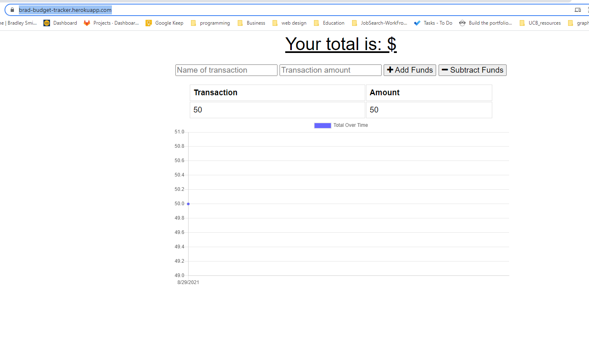

# Budget Tracker 

## Description
Updating existing code base to serve as Progressive Web App with service worker and manifest.json
This will allow for the budget tracker to have offline capabilities.

## Technologies 
MongoDB with Mongoose
IndexedDB
Heroku deployment

## Links
GitHub: https://github.com/smithfamily42/budget-tracker
Heroku: https://brad-budget-tracker.herokuapp.com/

### Screenshot

### License
MIT License is used for this project. Please refer to the license.txt file for more details.